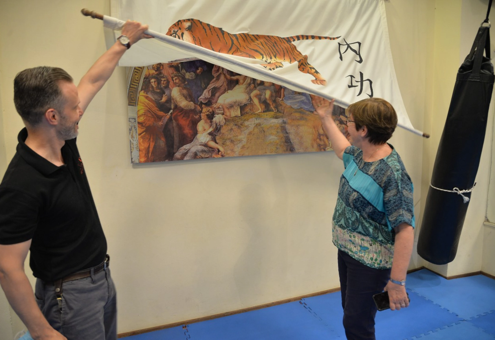
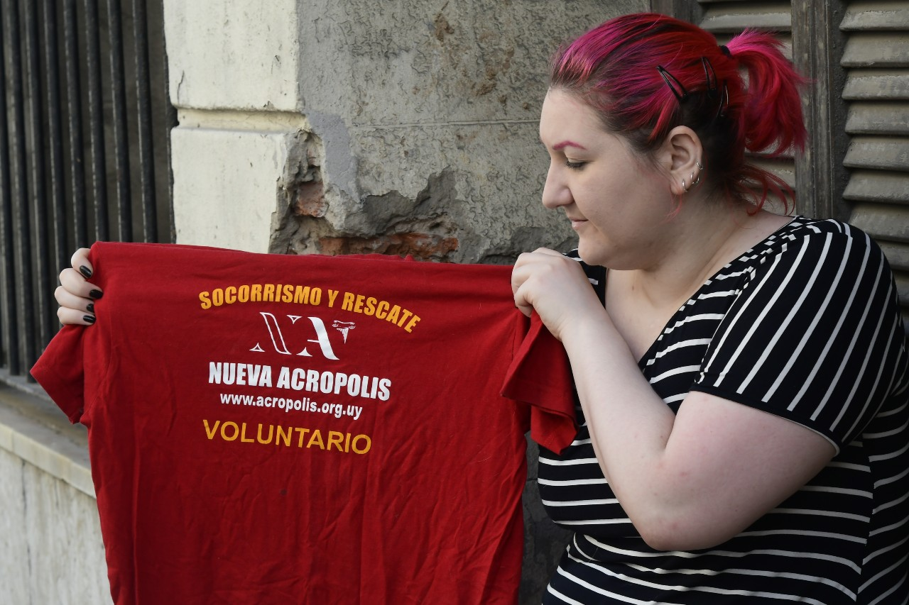
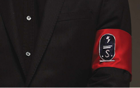
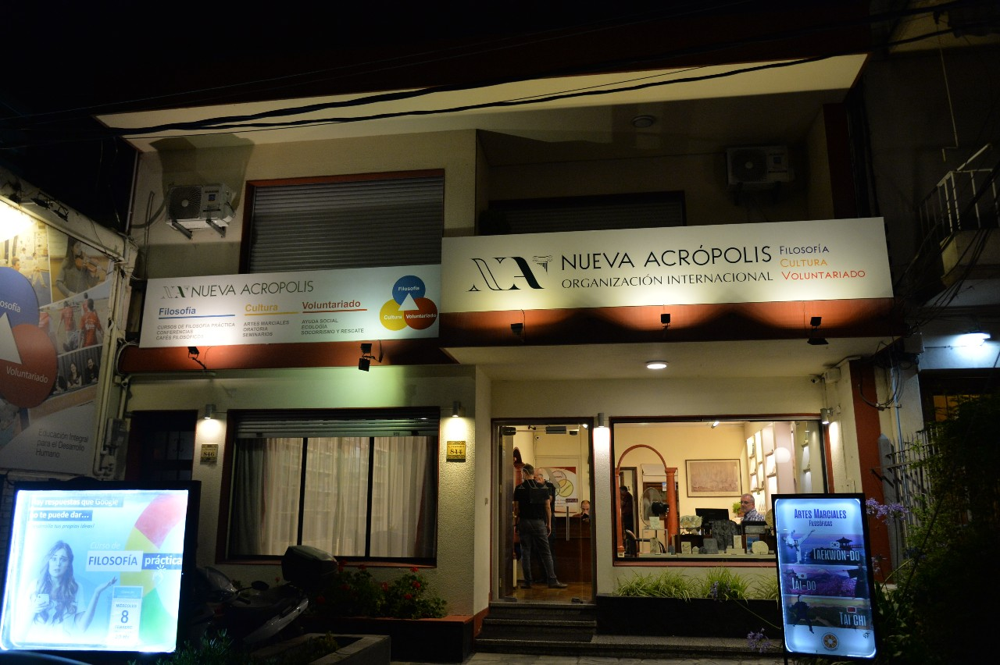
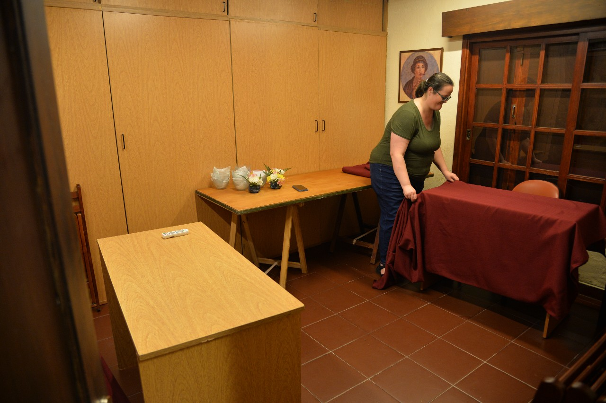
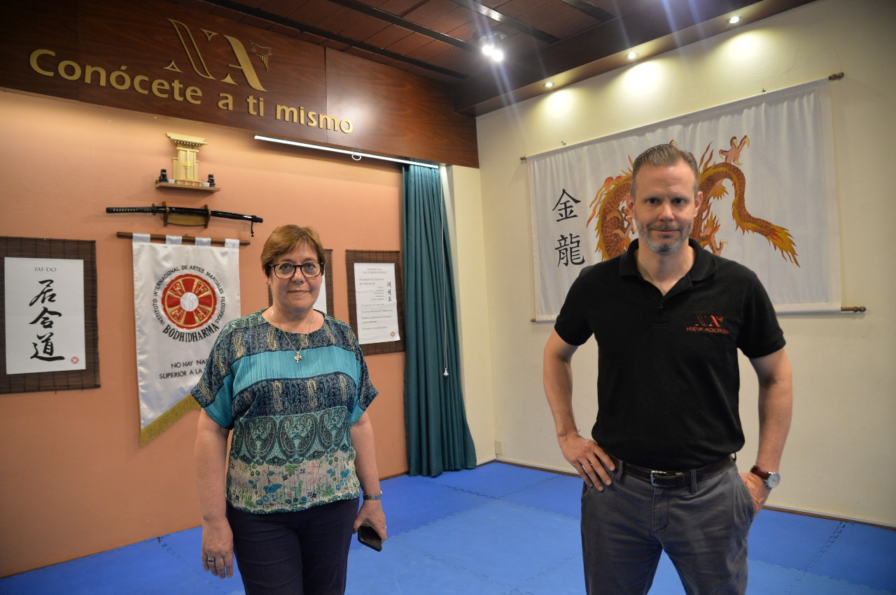

Φωτογραφία: Juan Manuel Ramos.

Το μήνυμα της μνήμης είναι αναμνηστικό. Έχουν περάσει πολλά χρόνια, αλλά... **Ντανιέλα Scuadroni** Κλείνει τα μάτια του και λέει, " Μπροστά στην αθάνατη ψυχή μου και τους συνανθρώπους μου στην αναζήτηση της σοφίας, δεσμεύομαι να **υπηρετώ με αφοσίωση** και αποτελεσματικότητα και, αν όχι, ότι η μοίρα, οι θεοί και η εθνική μου εντολή με ονειδίζουν. "

Αυτό είπε μέσα του. **δέσμευση για αφοσίωση**όταν έγινε δεκτή ως μέρος της **Νέες Ζωντανές Δυνάμεις της Ακρόπολης**, μια οργάνωση που παρουσιάζεται ως πολιτιστική και φιλοσοφική, αλλά που επισημαίνεται από ειδικούς και πρώην μέλη ως αίρεση. Όχι μόνο εδώ: ιδρύθηκε το 1957 από **Αργεντινή Χόρχε Άνγκελ Λιβράγκα** και η γυναίκα του **Άντα Άλμπρεχτ** και, εξαπλώνεται σε όλο τον κόσμο, είναι παρούσα σε 54 χώρες. Στην Ουρουγουάη έχει δύο κεντρικά γραφεία, ένα στα Ποοκύτταρα, ένα στην Κολωνία.

Η Daniella εισήλθε σε ηλικία 14 ετών μετά από **Διάσκεψη για την αλχημεία** Αλλά μόνο όταν ήταν 18, έγινε μέλος των δυνάμεων του Viva. Εκείνη τη μέρα φορούσε μια μπλε στολή και ένα εντυπωσιακό βραχιόλι, όπως όλοι οι άνθρωποι γύρω της. Ήταν γονατιστός μπροστά σε ένα λάβαρο με έναν αετό και το δεξί του χέρι σηκωμένο.

Ήταν ακροπολίτης, όπως αποκαλούν τα μέλη αυτής της οργάνωσης, για 11 χρόνια. Έφυγε το 2014 αλλά του πήρε μια καλή στιγμή για να επεξεργαστεί όλα όσα του είχαν συμβεί. Σήμερα, σε ηλικία 33 ετών, θυμηθείτε:

\- Δεν σκόπευα να φύγω. Καλύτερα να πεθάνω, παρά να πεθάνω. **Εγκαταλείψτε τη Νέα Ακρόπολη**Μου είπαν ότι θα άλλαζε τον κόσμο. Δεν ήταν η Ντανιέλα, ήμουν ακροπολίτης.

Ντανιέλα Μοίρα, πρώην μέλος των Νέων Ζωντανών Δυνάμεων της Ακρόπολης. Φωτογραφία: Estefanía Leal.

Το Εγκυκλοπαιδικό Λεξικό των Σεκτς, γραμμένο από τον εκλιπόντα Ισπανό ιερέα Manuel Guerra και ίσως το πιο ολοκληρωμένο έργο που υπάρχει πάνω στο θέμα στα ισπανικά, ορίζει τη Νέα Ακρόπολη ως μια "οιστορική, νεοπαγανιστική και παραστρατιωτική σέκτα, της θεοσοφικής αποτύπωσης.

Η πρόσοψη, εξηγούν εκεί, είναι η πραγματοποίηση μαθημάτων διαφόρων θεμάτων, όπως φιλοσοφία, πολεμικές τέχνες και εθελοντισμός. Όταν λες πόλεμο. Αλλά με την πάροδο του χρόνου μερικοί ενθαρρύνονται να ενσωματωθούν σε μια κρυφή δομή μιας οργάνωσης που επιδιώκει να δημιουργήσει έναν "νέο και καλύτερο κόσμο," με τις Ζωντανές Δυνάμεις της (που περιλαμβάνουν ανδρικές ή εργατικές ταξιαρχίες, γυναικείες ταξιαρχίες, καθώς και το σώμα ασφαλείας). Υπάρχει επίσης μια εκλεκτή ομάδα ηγετών που ονομάζεται hashados, οι οποίοι έχουν μεγαλύτερη δέσμευση.

Για να μπείτε, πρέπει να πληρώσετε ένα δέκατο, το οποίο κυμαίνεται μεταξύ 1.200 και 1.700 πέσος το μήνα ανάλογα με τον τόπο του ατόμου, εκτός από συγκεκριμένες δωρεές και την υποχρέωση να εργάζεστε τουλάχιστον τρεις ή τέσσερις ώρες την ημέρα. Οι περισσότεροι το κάνουν από τον ταρδίτη, αφού αφήσουν το έργο τους ή τις σπουδές τους. Υπάρχουν 112 μέλη σήμερα.

## Έτσι ντύνονται τα μέλη των ταξιαρχιών.

Στις εσωτερικές δραστηριότητες τα μέλη των ανδρικών ή εργατικών ταξιαρχιών -που είναι υπεύθυνα για την επισκευή πραγμάτων, μεταξύ άλλων εργασιών- φορούν πουκάμισο και ανοιχτό καφέ γραβάτα, παπούτσια και μαύρο παντελόνι. Κάνουν παρελάσεις και ασκήσεις διανοητικού ελέγχου και προσωπικής άμυνας. Φοράνε πορτοκαλί βραχιόλι. Τα μέλη των γυναικείων ταξιαρχιών, μπλε και λευκή μπλούζα. Το βραχιόλι είναι σκούρο μπλε. Ασχολούνται κυρίως με την κοινωνική και τη διατήρηση της ομορφιάς των τόπων.

Το διακριτικό "χάσαντος," που έχει υψηλότερο επίπεδο, είναι ένα τσεκούρι. Φοράνε παντελόνι, πουκάμισο και μαύρη γραβάτα. Χρησιμοποιούν μια καρφίτσα σε σχήμα τσεκούρι, στην οποία είναι μπλεγμένοι με χρυσές αλυσίδες καθώς υψώνονται.

Εν τω μεταξύ, τα μέλη του σώματος ασφαλείας μπορούν να μεταφέρουν όπλα, σύμφωνα με το Εγκυκλοπαιδικό Λεξικό των Σεκτ. Στην Ουρουγουάη σε κάποια πολύ συγκεκριμένη περίπτωση το κάνουν, όπως γνώριζε ο Ελ Παΐς. Η στολή των μελών του σώματος ασφαλείας, αναφέρει ότι το βιβλίο που έγραψε ο Ισπανός ιερέας Μανουέλ Γκερά, συμπίπτει με αυτό των Ναζί Ες Ες. Φοράνε ένα κόκκινο βραχιόλι με ένα S και ένα βέλος. Η θέση του Αρχηγού Πληροφοριών μπορεί να είναι γνωστή, αλλά οι δραστηριότητές του πρέπει να είναι μυστικές, καθώς και οι επαφές του.

Βραχιόλι ασφαλείας της Ακρόπολης.

Ο Luis Santamaría, Ισπανός ειδικός στις αιρέσεις, απαντά στον El País από την πόλη Zamora και αναφέρει ότι η Nueva Acropolis έχει "μια εξωτερική εμφάνιση του πολιτιστικού συλλόγου" και "μια εσωτερική πραγματικότητα μιας αρχικής ομάδας κρυμμένων δογμάτων.

\- Γιατί είναι αίρεση;

\- Είναι μια ομάδα που έχει διπλή πραγματικότητα - λέει αυτός ο ερευνητής του Ιμπερο-Αμερικανικού Δικτύου Μελέτης των Σεκτ. Η εκπαιδευόμενη είναι μια εσωτερική σχολή για να διδάξει τα επιδέξια διαδοχικά μυστήρια. Αυτό είναι ένα χαρακτηριστικό των αιρέσεων: οι διαδικασίες στρατολόγησης με αυτή την εξαπάτηση και οι τεχνικές της πειθούς. Το ίδιο ισχύει και για την προοδευτική διάλυση των προηγούμενων κοινωνικών σχέσεων, κάτι που δεν πρέπει να συμβεί σε έναν πολιτιστικό οργανισμό. Και τότε το άτομο βλέπει ότι είναι δύσκολο να βγει ή δεν σκέφτεται καν την έξοδο επειδή ο έξω κόσμος είναι κακός.

\- Τι ψάχνουν οι ηγέτες;

\- Είναι οι εκλεκτοί. Είναι πεπεισμένοι για την ελιτίστικη αλήθεια για πολύ λίγους ανθρώπους. Θέλουν να φτάσουν σε ένα ακροπολιτικό κοινωνικό και πολιτικό σύστημα σε όλο τον κόσμο, με απήχηση της Ελλάδας και της Ρώμης της κλασικής Αρχαιότητας.

Καθώς δεν υπάρχουν, εκτός από συγκεκριμένες περιπτώσεις, αναφορές σεξουαλικής κακοποίησης ή οικονομικά προβλήματα, είναι δύσκολο να βρεθεί ένα συγκεκριμένο έγκλημα, Santamaría εξηγεί, και λέει ότι η ψυχολογική χειραγώγηση ή εξαναγκασμός πειθώ " είναι δύσκολο να αποδειχθεί" και "ενοχλώντας για όσους πέρασαν την εμπειρία.

## Τα μυστικά.

"Καλώ τους Αθάνατους Θεούς να σας δώσουν όλο το Φως και την απαραίτητη ικανότητα εργασίας για να ταξιδέψετε το απότομο μονοπάτι που οδηγεί από τη Γη στον Ουρανό," λέει το Εγχειρίδιο του Ηγέτη, γραμμένο από τον Jorge Ángel Livraga το 1976. Επίσης αναφέρει ότι υπάρχουν τρία θεμελιώδη σύμβολα: ο αετός, η φωτιά και το τσεκούρι. Αλλά αυτά τα σύμβολα δεν βλέπουν αυτούς που πηγαίνουν στις συζητήσεις φιλοσοφίας.

Στο Εγκυκλοπαιδικό Λεξικό των Σεκτ, ο Πόλεμος αναφέρει ότι όταν οι ακροπολίτες αρνούνται κάτι από την εσωτερική τους δομή που τους καταλογίζεται, δεν ψεύδονται, γιατί "περιορίζονται στην υπεράσπιση ενός από τα θεμέλιά τους, στο να κρατούν το μυστικό για να μην το μοιράζονται με όσους δεν είναι προετοιμασμένοι για αυτό ή με όσους μπορούν να το λερώσουν." Το εσωτερικό, το εσωτερικό, είναι αποκλειστικά για τη σοφία των εκλεκτών.

Αυτό που μπορεί να ανακοινωθεί σε όλους, " το εξωτερικό," είναι " όπως η μάσκα με την οποία να έρθει πριν από το μη αρχικό." Το να αποκαλύψεις ένα ακροπολιτικό μυστικό είναι σαν προδοσία.

Δεν είναι θρησκεία, αλλά έτσι φαίνεται. Ένα από τα μυστικά είναι ότι οι ακροπολίτες πιστεύουν ότι η ζωή χαρακτηρίζεται από "στοιχεία της φύσης." Τι είναι; Τα στοιχεία της φωτιάς είναι οι σαλαμάνδρες· αυτά του αέρα, τα σύλφη και τα ξωτικά· του νερού, των νυμφών· της γης, των ξωτικών. Πιστεύουν επίσης στην εμφάνιση μιας νέας φυλής, την οποία αποκαλούν "έξη υποφυλή," προικισμένη με την " αίσθηση της διόρασης ή αντίληψη του αόρατου και ανέφικτη στις αισθήσεις. Και λένε ότι σε μια στιγμή ο πλανήτης θα ξεκινήσει μια μακρά διαδικασία διάλυσης.

Νέα Έδρα Ακρόπολης στα Κελιά. Φωτογραφία: Juan Manuel Ramos.

Ο πόλεμος μιλάει για μια παραστρατιωτική αίρεση με ένα νεοφασιστικό σημάδι. Στην πραγματικότητα, μια έκθεση του Ευρωπαϊκού Κοινοβουλίου του 1985 για το φασισμό και το ναζισμό αναφέρει τη Νέα Ακρόπολη. Υπάρχουν κάποια στοιχεία που εξηγούν αυτόν τον ορισμό. Ο επίσημος ακροπολιτικός χαιρετισμός, "ιδιωτικά, ποτέ δημόσια," είναι ο βραχίονας ψηλά με την παλάμη του χεριού απλωμένη προς τα κάτω, τα δάχτυλα μαζί και με γωνία 45 μοιρών πάνω από το σώμα. Ο αετός των πτερύγων που αναπτύσσεται σε αύξουσα θέση είναι παρόμοιος με τον Ναζιστικό αετό, λέει ο Πόλεμος. Και η εκπαίδευση, θα δούμε, είναι πολύ δύσκολη.

Ανάμεσα στις υποχρεώσεις των ακροπολιτάνων είναι "να είναι πάντα διαθέσιμος για το έργο που τους ανατίθεται," να μετριαστεί στο αλκοόλ (" να έχουν την κομψότητα να μην πέσουν στη μέλισσα, η οποία ηλιθιάζει τους ανθρώπους"), στο κάπνισμα και στη σεξουαλικότητα (η αγνότητα είναι ένα επιθυμητό ιδανικό και σε ένα κείμενο του ιδρυτή συνιστάται " να μην παραδοθούν στους αχαλίνωτους. Συνιστάται να απομακρύνεται η χορτοφαγία από την πολιτική (" οι τρέχουσες πολιτικές θέσεις είναι κενές από πνευματικό περιεχόμενο"), που "να απομακρύνονται από τα ναρκωτικά, τους ομοφυλόφιλους και τους κλέφτες," να έχουν μικρή σχέση με ανθρώπους έξω, να ασχολούνται με την πρόσληψη συμπατριωτών, να δίνουν διαλέξεις και να οργανώνουν σεμινάρια για διαφορετικά θέματα, από την αρχαιολογία και τον οισοτερισμό, μέχρι την Ινδία, τον Πλάτωνα και τα μυστήρια του Θιβέτ. Είναι υποχρεωτικό να κάνουμε μια πορεία προσευχής και να επικολλήσουμε αφίσες διάδοσης σε όλη την πόλη.

Και τι λένε από τη Νέα Ακρόπολη; Η ιστοσελίδα αναφέρει ότι οι αρχές είναι αυτές της αδελφοσύνης, της γνώσης και της ανάπτυξης του ανθρώπου. Διευθυντής της είναι η Γκαμπριέλα Φεόλα, μια 66χρονη χημικός που κατείχε θέσεις στο Montevideo Intrend (IMM) την τελευταία δεκαετία, ήταν διευθύντρια της Μονάδας Ανεπάρκειας και της Υπηρεσίας Αξιολόγησης Ποιότητας και Περιβαλλοντικού Ελέγχου. Γνώρισε τη Νέα Ακρόπολη το 1994 από συνάδελφο στο ΙΜΜ, ο οποίος την κάλεσε να συμμετάσχει. Και αρνείται κάθε κατηγορία για αίρεση. "Δεν έχουμε τίποτα να κρύψουμε," λέει και γελάει όταν απαντάει τηλεφωνικά στον Ελ Παΐς.

Η έκδοση της Νέας Ακρόπολης θα μετρηθεί στο τέλος αυτού του άρθρου. Πριν από αυτό, για να κατανοήσουμε καλύτερα τους ισχυρισμούς, είναι απαραίτητο να γνωρίζουμε τις μαρτυρίες όσων βρίσκονταν μέσα και αριστερά.

Η ΔΙΑ STRUCTUREΘΡΩΣΗ

## Ο διοικητής και ο φύλακας των γραμματοσήμων

Η ακροπολίτικη κλίμακα έχει διάφορα βήματα. Πάνω από όλα είναι ο ανώτατος διοικητής του κόσμου (ο οποίος είναι σήμερα ο Ισπανός Carlos Advanced), τότε ο ηπειρωτικός και εθνικός. Διαθέτει ένα στερεό χρυσό τσεκούρι με "ένα πολύπλευρο σμαράγδι ενσωματωμένο στη μια πλευρά του κεφαλιού του τσεκούριυ." Στη συνέχεια έρχεται ο φύλακας των γραμματοσήμων ή αναπληρωτής γενικός διευθυντής, ο οποίος φέρει ένα τσεκούρι με σιδερένια κεφαλή, το οποίο περιέχει " δύο χρυσά χέρια κρατώντας μια φλόγα."

Στο άλλο άκρο, το πρώτο βήμα είναι ο "αποκλεισμός," όπου το άτομο βρίσκεται σε δοκιμασία και λαμβάνει μαθήματα φιλοσοφίας, κοινωνικο-πολιτικής, μετενσάρκωσης ψυχών, Βουδισμού, Πλωτίνο, Νέου Μεντιόεβο "που θα τερματίσει τη δημοκρατία" και Δυτική ευημερία, και άλλα ζητήματα.

## Οι ιστορίες.

Ο Μάρτιν ήρθε ως έφηβος και συνάντησε έναν ωραίο κόσμο, με χαρούμενα πρόσωπα, όπου έδωσαν προσοχή σε όλα όσα είπε, αν και στην αρχή ξαφνιάστηκε που στην πορεία της φιλοσοφίας γινόταν λόγος για εσωτερικά ζητήματα χωρίς να δώσει χώρο για συζήτηση.

\- Χρόνια αργότερα θα ανακάλυπτα ότι έχουν ακόμη και μια γραμματεία ενσωμάτωσης που είναι αφιερωμένη στην ανάλυση των ανθρώπων και βλέποντας ποιες δραστηριότητες μπορούν να προτείνουν με βάση την προσωπικότητα, να τους συνδέσουν - αυτός ο εξωπολίτης λέει, σε συνέντευξη με τον El País σε ένα μπαρ του Κέντρου του Montevideo, και ζητά να μην ταυτιστεί με το πραγματικό τους όνομα: φοβάται τα αντίποινα. Είσαι πολύ απροστάτευτος από αυτή τη δομή, υπάρχει ένας ισχυρός μηχανισμός χειρισμού.

Έμαθε ότι ήταν πιο σημαντικό να πάει στη Νέα Ακρόπολη από το να περάσει χρόνο με τους φίλους και την οικογένειά του και να τον μορφώσει ότι το σωστό είναι ότι "ένα εξελιγμένο ον" κάνει πράγματα που δεν θέλει to επιδιώκοντας το κοινό καλό. Αν και εκείνη την εποχή αισθανόταν καλά και υποστήριζε, σε μια πολύ λεπτή μετάβαση άρχισε να ενσταλάζει ιδέες όπως ότι η αμφιβολία ήταν αρνητική, χαρακτηριστική του "κάμα- μανάς," του εγωιστικού μυαλού. Έμαθε επίσης "την ιδεολογία της υπακοής."

\- Αυτός που ξέρει, ξέρει και δεν το αμφισβητώ.

Λίγα χρόνια αργότερα, του είπαν ότι ο Jorge Ángel Livraga είναι ένα "μισή ζωή είναι, ένας από εκείνους τους χαρακτήρες που, μέσω της πνευματικής τους ανάπτυξης, κατέλαβε αιώνιες αλήθειες. Και εκείνοι που τον ακολουθούν είναι επίσης ιδιαίτερα όντα. Ότι ο κόσμος είναι "σε βάναυση διαφθορά" και ότι θα πρέπει να είναι "όπως εκεί in όπως στη Νέα Ακρόπολη.

\- Πιστεύουν ότι είμαστε στο Μεσαίωνα, ότι ο πολιτισμός θα καταρρεύσει και ότι θα επιβιώσει μόνο στη Νέα Ακρόπολη.

Δεν ήταν η μια μέρα για την άλλη αλλά ήρθε μια εποχή που είχε σχέση μόνο με ανθρώπους της οργάνωσης, ριζοσπαστικοποιημένους και φαινόταν " στριφογυρισμένος" με τους έξω:

Το πρόβλημα είναι ότι τα πιο σκοτεινά πράγματα σου συστήνονται τέσσερα χρόνια αργότερα, όταν έσπασες τους δεσμούς με όλους και η ζωή σου είναι εκεί μέσα.

\- Ποιο είναι το πιο σκοτεινό πράγμα;

\- Μπήκες σε φιλοσοφία και νοητική διαφάνεια και στο τέλος σου λένε για την υπακοή. Και πρέπει να το δεχτώ. Γιατί το κόστος της εξόδου είναι πολύ μεγάλο. Και είναι σταδιακή η διαδικασία με την οποία ο ορθολογισμός περιορίζεται και όπου καθίσταται σαφές ότι για να αμφισβητηθεί κάτι πρέπει να λείπει. Και μετά διαβάσατε τα κείμενα του ιδρυτή, ο οποίος είχε θαυμασμό για τον Χίτλερ, τον Φράνκο και τον Μουσολίνι, πώς γίνεται τόσα χρόνια αργότερα να ανακαλύπτω τι σκέφτεται για τη ζωή;

Ένα δωμάτιο στα κεντρικά γραφεία της Νέας Ακρόπολης. Φωτογραφία: Juan Manuel Ramos.

Η πρόσκληση να ανήκουν στον εσωτερικό κύκλο, τις Ζωντανές Δυνάμεις, ήταν μια μακρά διαδικασία που κατέληξε στις λεγόμενες δοκιμές "πεδίου," που σε ορισμένες περιπτώσεις (όχι όλες) μπορεί να είναι τραυματική. Στην Ουρουγουάη τελούνται στην "ρωμαϊκή βίλα," ένα εξοχικό σπίτι στην Pirarajá της Lavalleja.

Το ταξίδι βρίσκεται σε αυστηρή σιωπή χωρίς να γνωρίζουν πού πηγαίνουν, όταν φτάνουν εκεί διαβάζονται γραπτά του ιδρυτή και στη συνέχεια πουλούν τα μάτια τους. Μεταξύ άλλων δοκιμασιών όπου οι αναπνευστήρες είναι γυμνοί, παίρνουν ένα σχοινί που σημαίνει " τον τρόπο των δασκάλων, δηλαδή, Νέα Ακρόπολη" και τους ρίχνουν στη μια πλευρά και στην άλλη· τους θάβουν λίγο σε ένα πηγάδι με μια ίντσα γης πάνω από το κεφάλι τους μέχρι να ακουστεί ένα κέρατο· τους πηγαίνουν σε μια λίμνη και βάζουν τα κεφάλια τους στο νερό· τους κάνουν να ανέβουν σε ένα μέρος και να πηδούν στο κενό χωρίς να γνωρίζουν πού τελειώνει, μέχρι να πέσουν στο νερό. Και όλα αυτά.

"Το πιο ταπεινωτικό είναι ότι το δέχτηκα," λέει, παραιτήθηκε.

Στο τέλος, όταν ήταν ήδη μέλος των δυνάμεων του Viva, κάθισε δύο ώρες κοιτάζοντας το βραχιόλι και μπήκε σε ένα δωμάτιο όπου όλα σχηματίζονται και ο διάσημος αρραβώνας πρέπει να γίνει. Τότε του ζήτησαν να μην προδώσει "το ιδανικό και τους δασκάλους" και του έδωσαν μια συμβολική κρύπτη.

\- Σε εκπαιδεύουν με αυτόν τον τρόμο. Παίζουν με τα γλυκά και το ραβδί, αλλά υπάρχουν όλο και λιγότερα γλυκά και περισσότερο ραβδί. Και σε μια στιγμή όλα κολλάνε: κάθε φορά που κάνεις κάτι που δεν ταιριάζει στην αίρεση, είσαι ένας εγωιστής που δεν σκέφτεται τους άλλους - λέει ο Μάρτιν. Θυμάμαι την τέλεια στιγμή που για πρώτη φορά σκέφτηκα να φύγω και τρομοκρατήθηκα από τη δική μου σκέψη.

Και όταν τελικά έφυγε, ξεκίνησε ένα προσωπικό "μάρτυρο" για να προχωρήσει, κλαίγοντας κάθε βράδυ και έπρεπε να τον συμβουλεύει ψυχολόγος.

Η ιστορία της Άννας, 35 ετών και του οποίου το όνομα άλλαξε επίσης για να διατηρήσει την ταυτότητά της, είναι αρκετά παρόμοια, αλλά συνέβη στην Ισπανία. Ήρθε για ένα συνέδριο ψυχιάτρου και ήταν 10 ετών. Έφυγε πριν από έξι. Πείτε την ιστορία σας στο El País ενώ ταξιδεύετε στο μετρό:

\- Ήμουν πολύ φαντασμένος. Πήγαινε κάθε μέρα, Δευτέρα με Κυριακή. Είχα αφήσει φίλους, οικογένεια και μελέτη. Σκεφτόμουν την αίρεση. Όλο το χρόνο μου χωρίς δουλειά, το έκανα αυτό.

Έκανε τα πάντα από τον καθαρισμό της έδρας, "λαμβάνοντας" την ιστοσελίδα και κάνοντας δημόσιες σχέσεις. Στη συνέχεια δίδαξε και εκεί είχε τα πρώτα προβλήματα με τους δασκάλους του για συγκρούσεις.

\- Γιατί στην αρχή είσαι σε ένα όνειρο και νομίζεις ότι είσαι αυτός που θα σώσει τον κόσμο, εξηγεί. Καταλήγεις να πιστεύεις ότι ο ηγέτης Χόρχε Έιντζελ Λιβράγκα είναι απεσταλμένος των πνευματικών όντων, ο οποίος ονομάζεται λευκή ιεραρχία. Αλλά μπήκες εκεί μέσα σε κάτι άλλο και κατέληξες έτσι, οπότε είναι μια αίρεση 100%. Υπάρχει πολύ ψυχολογικός εξαναγκασμός.

Η εμπειρία του στις δοκιμές πεδίου ήταν ίση ή πιο περίπλοκη από του Μάρτιν. Λέει ότι τον χτύπησαν και τον έκαναν να χαστουκίσει έναν συνεργάτη ("και αν χαλάρωσες, φώναξες να είσαι δυνατός"), αλλά δεν μπορούσε να εκφράσει πόνο. Το χειρότερο, λέει, ήταν όταν τον χειμώνα την πήγαν στο βουνό, την σκέπασαν τα μάτια, την έγδυσαν και την έβαλαν σε ένα ποτάμι με παγωμένο νερό.

\- Για ποιο λόγο;

\- Δεν μας το είπαν. Απλά έπρεπε να υπακούσεις. Μετά ανακάλυψα ότι ήταν για να ελέγξω τα συναισθήματα.

Όταν έφυγε, του είπαν ότι η ψυχή του ήταν "εκτός," ότι η ψυχή του ήταν "σκοτεινή." Έπρεπε να ξαναφτιάξει τη ζωή της: ήταν μόνη και ήταν 29. "Είναι δύσκολο, γιατί βγαίνεις έξω νομίζοντας ότι ο κόσμος είναι κακός," λέει, "Είναι δύσκολο να εμπιστευτείς ξανά."

Θα επιστρέψουμε στο Μοντεβιδέο. Στο παλιό της σπίτι, συνοδευόμενο από το αγόρι της και τρεις γάτες, η Ντανιέλα θυμάται ότι προσπάθησε να πιάσει όλους τους φίλους της.

\- Ευτυχώς δεν τα κατάφερα. Τους κάλεσα σε συνέδρια και ρεσιτάλ. Θα με χτυπούσαν αλλά δεν έμεναν γιατί δεν ενδιαφέρονταν - θα γελούσα. Αλλά στη Νέα Ακρόπολη άρχισαν να μου μιλάνε γι' αυτούς, μου είπαν ότι ήταν όλοι περίεργοι, έβγαινα έξω... Με θεωρούν σχεδόν προδότη που έχω φίλους έξω.

Ντανιέλα Σουντόνι. Φωτογραφία: Estefanía Leal.

Είπε ότι μπήκαν και αυτοί στην αισθητική και του ζήτησαν να μην ντύνεται με φρενήρη τρόπο, να είναι πιο θηλυκά και κομψά, χωρίς "υπερβολή, χωρίς να είναι σέξι."

Και συνοψίζει:

\- Όλη την ώρα πίεζαν για τα πάντα, για το πώς ντύθηκες, για αυτό που έκανες, για αυτό που έλεγες.

Αλλά πήρε " πίεση" ως απόδειξη. Χρόνια μετά την αναχώρησή του από τη Νέα Ακρόπολη - η οποία επιταχύνθηκε αφού κάποιος ανέβασε φωτογραφίες της στο Facebook πίνοντας αλκοόλ σε ένα στρατόπεδο και μεταμφιεσμένος σε βρικόλακες με τους φίλους της, και όπου επίσης είχε μια ισχυρή κατάθλιψη που υπέστη - δημοσιοποίησε την κακή του εμπειρία μέσα από διαφορετικά βίντεο στα κοινωνικά δίκτυα. Τόσο πολύ που έγινε αναφορά στο θέμα και τον τελευταίο χρόνο γράφτηκε σε δεκάδες ανθρώπους από όλο τον κόσμο. Η αποχώρησή του, λέει, ήταν "ένα τραγανό της ελευθερίας." Ζει σήμερα ως προσωπικός προπονητής.

## Ερωτική βομβιστική επίθεση.

Πέμπτη, μετά τις 8:00. Στην υποδοχή του αρχηγείου υπάρχουν άνθρωποι που μπαίνουν και βγαίνουν, κάποιοι που έρχονται σε μαθήματα, άλλοι που είναι μέλη των Ζωντανών Δυνάμεων και αφιερώνουν μεγάλο μέρος της ζωής τους στην οργάνωση. Με τη σειρά του είναι ο Angkor, ένας παιχνιδιάρης εργάτης σκύλος που οι ακροπολίτες διασώθηκαν από το δρόμο, λένε.

Χαμογελάνε ωραία, γλυκά. Στο σπίτι του Φραντζίνι και της Σκοσερίας όλα παραγγέλνονται και πουλχρέ.

Σε έναν τοίχο υψώνεται η τεράστια βιβλιοθήκη Πλωτίνο (από τον νεοπλατωνικό φιλόσοφο), ταξινομημένη σύμφωνα με διαφορετικές κατηγορίες, όπως ιερά κείμενα, κινεζική φιλοσοφία και οισοτερισμός. Ένας ακροπολίτης οργανώνει λουλούδια και στη συνέχεια εμφανίζεται - επίσης χαμογελαστός, φυσικά- ο Φεόλα, ο σκηνοθέτης, συνοδευόμενος από τον Μαουρίσιο Πουέντε, ο οποίος είναι διευθυντής του κέντρου των Κυττάρων.

Είδε ένα μαύρο πουκάμισο με το λογότυπο της Νέας Ακρόπολης. Είναι μια πολύχρωμη μπλούζα και φοράει ένα μενταγιόν με ένα μικρό τσεκούρι. Επίσης ένα ankh ή κλειδί της ζωής και ένα σκαθάρι, δύο αιγυπτιακά σύμβολα. Το χαμόγελό του μεταδίδει ειρήνη αν και το πρόσωπό του θα αλλάξει κατά τη διάρκεια της ομιλίας. Αλλά όχι στην αρχή: κάθε φορά που υπάρχει ένας νέος επισκέπτης, αντιστοιχεί σε αυτό που αποκαλούν " ερωτική βομβιστική επίθεση.

Γκαμπριέλλα Φεόλα και Μαουρίσιο Πουέντε ντε Νουέβα Ακρόπολις. Φωτογραφία: Juan Manuel Ramos.

"Θα το καταγράψω," λέει ο Φεόλα και θα βάλω το κινητό του στο τραπέζι.

Υπάρχουν ισχυρισμοί ότι η Νέα Ακρόπολη είναι αίρεση.

"Να μας πείτε," απάντησε ο Puente, "Υπάρχει ένα blog όπου πέντε άτομα με ονόματα και ονόματα μιλούν ότι.

"Πάντα υπάρχουν άνθρωποι που διαφωνούν," προσθέτει ο Feola. Μερικές φορές δεν μας καταλαβαίνουν, ή δεν βρήκαν αυτό που έψαχναν και ήταν απογοητευμένοι.

\- Αλλά υπάρχουν πράγματα που επαναλαμβάνονται στις μαρτυρίες: ότι υπάρχει μια πρόσοψη των μαθημάτων και ότι στη συνέχεια προσπαθείτε να συλλάβει για να τα ενσωματώσει στις ζωντανές δυνάμεις.

"Πρώτα, δεν έχουμε κανέναν," λέει ο σκηνοθέτης. Και δεν έχουμε καμία σχέση με αιρέσεις: αυτός που θέλει να φύγει, φεύγει. Και αυτός που επιστρέφει, επιστρέφει.

Είναι σαφές ότι είναι ελεύθερος αλλά λένε ότι υπάρχει μια στιγμή που η απόφαση να φύγει προκαλεί τρόμο.

\- Πολύ υποκειμενικό όραμα. Ξέρω από πού προέρχεται. "Δεν είναι έτσι," λέει ο Φεόλα. Οι άνθρωποι έχουν δεσμευτεί να έρθουν. Δεν αγανακτούμε ούτε προσπαθούμε να τους χωρίσουμε από τους συγγενείς τους.

\- Αλλά σε ένα κείμενο του Λιβράγκα ζητείται: " Αρχίζει να σπάει άχρηστες αλυσίδες με φίλους και φίλους που δεν συμμετέχουν στο ιδανικό σας παρά τη γνώση του, και με όλους, όποιος κι αν είναι, να αντιταχθούν στο σημερινό πνευματικό σας όραμα, για τη διατήρηση αυτών των παλιών σχέσεων θα βλάψει εσάς και εκείνους τους ανθρώπους, που δεν έχουν ξυπνήσει ακόμα ως φιλόσοφοι; που θα ντρεπόταν για σας ή χλευάζονται από ό, τι έχετε από τα πιο ιερά: ακροπολίτικο ιδανικό σας.

"Δεν είναι τώρα," απάντησε. Ο θεσμός προσαρμόζεται στους χρόνους.

\- Αλλά ο ιδρυτής το έγραψε.

\- Ο ιδρυτής σε μια ιστορική στιγμή. Υπάρχουν εντελώς παρωχημένα πράγματα.

Είναι σαν να έχω ένα άρθρο από τη δεκαετία του '70 από το Ελ Παΐς.

\- Είναι διαφορετικά πράγματα. Το Εγκυκλοπαιδικό Λεξικό της Σέκτας, του Μανουήλ Γκερά, ορίζει τη Νέα Ακρόπολη ως μια "οισοτική, νεοπαγανιστική και παραστρατιωτική αίρεση."

Γελάνε.

"Νεοπαγάνα, παραστρατιωτικός, Ναζί," είπε ο Πουέντε. Αφού είσαι δημοσιογράφος έρευνας, αυτός που έγραψε ότι είναι ιερέας, έχει την προκατάληψη του. Θεωρούν επίσης την τοιχοποιία αίρεση.

Στις σκληρές δοκιμασίες εισόδου, και οι δύο παίρνουν την υπέρβαση και λένε ότι είναι "σύμβολα και τελετές," παρόμοια με το βάπτισμα της Καθολικής Εκκλησίας.

"Δεν γδύνει το άτομο ούτε το βάζει σε πηγάδι," λέει ο Πουέντε.

"Δεν πληγωνόμαστε καν," προσθέτει η Φεόλα.

\- Φαίνεται αρκετά τρελός.

\- Δεν καταλαβαίνεις.

\- Σαμπρί - μιλούν σε ένα κορίτσι στη δεξίωση - ήταν τραυματικό για σένα να δοκιμάζεις γη, νερό, αέρα και φωτιά;

\- Όχι, καθόλου. Τη θυμάμαι με αγάπη. Είμαστε όλοι μεγάλοι, λέει αυτή.

Η ομιλία τελειώνει και οι δύο προσφέρουν επίσκεψη στο διώροφο σπίτι. Στον τελευταίο όροφο υπάρχουν τρεις αίθουσες διδασκαλίας και σε έναν τοίχο μια εικόνα του ιδρυτή, Jorge Ángel Livraga. Κάτω, ένα καφενείο, ένα δωμάτιο με τέσσερα άτομα που είναι υπεύθυνα για τα δίκτυα και έναν άλλο χώρο που λειτουργεί ως αίθουσα συνεδριάσεων και τόπος για τις πολεμικές τέχνες.

Η ξενάγηση τελείωσε, αλλά κάτι λείπει.

\- Μπορώ να δω το ναό;

\- Όχι, είναι κρατημένο. Να τα σύμβολά μας.

Τέρμα τα ωραία χαμόγελα.

ΖΟΡΖ ΛΙΒΡΑΓΑ

## Τα κείμενα του Ιδρυτή

Ο Jorge Ángel Livraga, ιδρυτής της Νέας Ακρόπολης, αναφέρει στο Εγχειρίδιο του Ηγέτη, στο οποίο συμφώνησε ο El País: "Είναι απαραίτητο να διασφαλιστεί ότι οι δεσμοί με τους αντιφρονούντες δεν διατηρούνται για συναισθηματικούς λόγους, γιατί αν, μέσα τους, έχουν αποτύχει οι υποχρεώσεις τους, είναι εύκολο να συμπεράνουμε ότι δεν καταλαβαίνουν ή αγαπούν τη Νέα Ακρόπολη. Η διάσωση τους με θετικές και φιλικές εικόνες είναι μια πρόσκληση για τους άλλους να ακολουθήσουν τα ίχνη τους. Πρόκειται για ένα σαφές μήνυμα κοπής δεσμών, αλλά από τη Νέα Ακρόπολη οι αρχές αρνούνται ότι αυτό το κείμενο υπάρχει. Σε έναν από τους προμαχώνες του (κείμενα), η Λιβράγκα λέει: "Το πυραμιδοειδές σύστημα δεν είναι επιλογή. Η κρίση της εξουσίας δεν μπορεί να συζητηθεί." Σχετικά με την απόκτηση παιδιών: "Ένα ζευγάρι εξαιρετικών ακροπολιτών μπορούν να γεννηθούν παιδιά που στη συνέχεια ασχολούνται με ναρκωτικά, βία, κυνήγι περιουσίες με τα φύλα τους, ή... καταπολέμηση των ακροπολιτάνων. Με τέτοιο τρόπο, το Hachado δεν πρέπει να θυσιάσει τη ζωή του για να προκαλέσει πιθανούς εχθρούς.
