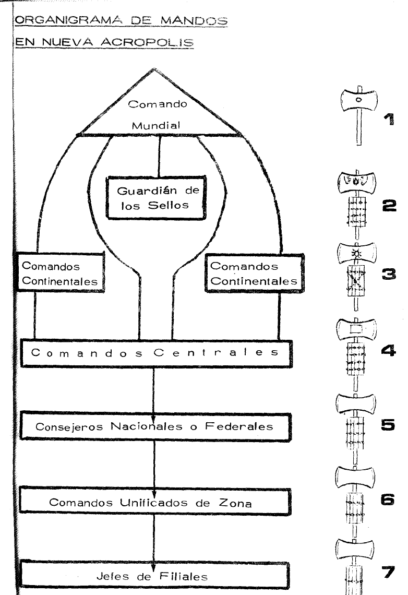

## İçerikler

-   Giriş I Giriş I *(özellikle kullanılabilir)*
-   Giriş II
-   "The Golden Axe":
    -   Bölüm I: Bir lider nedir?
    -   Bölüm II: Lider doğar ve yapılır.
    -   Bölüm III: İlk yıl.
    -   Bölüm IV: Liderin hayatı.
    -   Bölüm V: Liderin Gerçekliği.
    -   Bölüm VI: Kılıçlarda *(özellikle kullanılabilir)*
-   "The Maze of Lapislazuli"
    -   Bölüm I: "Yeni Akropolis."
    -   Bölüm II: "Yeni Akropolis"in yapısı.*(Tam olarak kullanılabilir)*
    -   Bölüm III: Piramit sistemi. *(özellikle kullanılabilir)*
    -   Bölüm IV: Ulusal bir yapı nasıl doğar.
    -   Bölüm V: Bir Federal Konsey veya Nacio nasıl oluşur... *(Bölüm taramaya kesilir)*
    -   Bölüm VI: Yaşam güçleri.
    -   Bölüm VII: Öğretmenler ve eğitmenlerin vücudu.
    -   Bölüm VIII: Enstitülerden.
    -   Bölüm IX: İdeal yaklaşım alt yapıları.
    -   Bölüm X: Filials.
    -   Bölüm XI: Propaganda.
    -   Bölüm XII: Kağıt / dokümantasyon ve semboller. *(özellikle kullanılabilir)*
    -   Bölüm XIII: Bir "Acropolis" sitesinin fiziksel dağılımı. *(özellikle kullanılabilir)*
    -   Bölüm XIV: Semboller.
    -   Bölüm XV: Hızlı genişleme durumunda nasıl hareket eder.
    -   Bölüm XVI: Bir kalmanın durumunda nasıl hareket edeceğim. *(özellikle kullanılabilir)*
    -   Bölüm XVII: İç kriz durumunda nasıl hareket edeceğim. *(özellikle kullanılabilir)*
    -   Bölüm XVIII: Dış saldırganlık durumunda nasıl davranılır.
    -   Bölüm XIX: Doğal bir gerileme veya bir yapının çökmesi durumunda nasıl davranılır. *(özellikle kullanılabilir)*

## Giriş I Giriş I

Bu Kılavuz, dış yayın için veya hatta yönetim sorumlulukları olmayan “Yeni Akropolis” üyeleri arasında dolaşım için tasarlanmıştır. Onun yayılması sadece tehlikeli olmaz, ama aynı zamanda işe yaramaz, çünkü bir dil ve bir ritmi ile anlaşılamayan bir ahlaki, entelektüel ve psikolojik hazırlık sınıflarımızda prudent bir süre boyunca anlaşılamaz.

Labyrinth'in eski efsanesine ilham verdi - en son Helenistik versiyonu öğrenciye erişilebilir olan tek kişi - bu metin, “burada ve şimdi” için kısa ve pratik olmak istiyor. Operasyonel karakterini korumak için örneklerde ve felsefi eğlencelerde genişlemeye olan günahtan kaçınılmıştır. Yeni doğan hareketimiz artık tamamen farklı ve organik olarak düşmanca bir dünyayla yüzleşmelidir. Zor bir yüzyılda zor bir görev aldık.

Bu Kılavuzun yansımaları, kuralları ve ipuçları kişisel ve tarihsel deneyimimizi bu kadar eşitsiz bir savaşta "kırık mızraklar" olan genç İdealiste aktarmak istiyor. Konuda bir "roof" olmak amaçlanmamıştır, ancak gelecekteki birikimi ve genişlemeleri olan bir "taban" yerine... *(Bu cümle taramada kesilir)*

Ahlaki otoritenin ortadan kalktığı bir dünyada, ruhsal Bastion fırtınada bir ışık olarak görünür. Zor zamanlar ve zor insanlar tarafından çevriliyiz. Ama sadece bizim firmamızı test edecek ve gün içinde zafer kılıcının fiery kenarı ile devam edeceğiz.

Bu çalışma, ışıklı kılıcı, o kutsal elşayı, toplam teslimiyetle elinde tutmak isteyenler için yazılmıştır. Ayrıca ona ilham verenler için de yararlı olabilir.

Bunu derinlikte okumayı ve aynı zamanda kurslarda çalışmayı öneririm - eğer mümkünse, uzak yerlerde - bir monastic-asker disiplini altında, deneyimli bir Slayer of Central Komutanlığı seviyesi veya daha yüksek tarafından yönlendirilir. Elbette süresi bir ila üç hafta arasında değişebilir. Seviyeler belirlenmelidir: Kılavuz aynı okusa bile, farklı açıklamalar ve genişlemeler liderler ve zaten liderler olanlara ve daha şimdiden liderlere ilham verenlere verilmelidir. Elbette tamamlanması pratik sonuçlar üretmelidir: yeni liderlerin ve tüm düzeylerde yeni genişlemelerin tanıtımı.

Eylem, Krishna bize “Bhagavad-Gita”da öğrettiği gibi, dünyamızdır. Her lider aktif olmalıdır. Doğru... *(Yazı taramada kesilir)*

*(Belir doğrudan Bölüm VI'ya atlar. Görünüşe göre I-V Bölümleri ile sayfalar bu dosyada eksik)*

## "The Golden Axe"

### Bölüm VI: Kılıçlarda *(özellikle kullanılabilir)*

... kişisel çabanıza ve gerçek yeteneğinize bağlı olacaktır: Komutunuz açık değilse / parlak değilse, henüz gerçek bir taşıyıcı değil **Gold Axe**. *(Yazı taramada kesilir)*

İdeal planda, işlevlerini tamamen yerine getiren tüm liderler olmalıdır **Fried**Ancak hareketimizin gençliği sadece onların bir parçası yapar.

The The The The The The The The **Aha**İdealimizin dünyasındaki akarnasyon sembolü olarak, verilir. **Sadece Dünya Komutanlığı**İki yüksek otoritenin yazılı onayı ile ( metinde teslim edilir). imtiyaz, bir Hachado seviyesi tarafından sunulan yazılı bir istek temelinde işlenir **Merkez Komutanlığı**Doğrudan veya aracılığıyla **Avrupa Komutanlığı** Genellikle uluslararası bir komutan toplantısında, acil veya özel ihtiyaçlar dışında.

Sadece sadece **Dünya Komutanlığı**Ancak Aha hibeleri olarak, bunu yapabilir **Nihai geri çekilme**Ancak, **Merkez Komutanlığı** olabilir olabilir olabilir olabilir olabilir **süspansiyon süspansiyon** Yapının içinde bir Slayer, Dünya Komutanlığının nihai kararına kadar etkili fonksiyonlardan uzaklaştırın.

Liderler Hachados için aday olarak önerilebilir **En az dört yıl** Orta Komuta'nın bakışında onları sunan harekette, yeterince devam eden ilkeler vardır. *( Cümle bir sonraki sayfada devam ediyor)*

Gerekli nitelikler türü olmalıdır **Okul / Eğitim** ve **örgütsel örgütsel örgütsel örgüt**, içinde **Yapılar** veya **Alt yapıları**Ve bir akropolitan ideolojik anlamda. Kişi, Acropolis'teki liderlik pozisyonunda değil **Yapamaz.** Bu şerefe ilham vermek.

Bir Slayer, cezalandırılmadan, devletine geçer **Withdrawal** Kendi özgür iradesi veya doğal kontrollerine karar vererek, iki kategoride bunu yapabilir:

1.  **Aktif Retreat**:: düzenli olarak "Yeni Akropolis" ile çalışmaya devam eder, ancak üst düzey pozisyonlardan serbest bırakılır.
2.  **Withdrawal** (basit): "Yeni Akropolis"e ait olmaya devam ediyor, ancak herhangi bir ücret, sorumluluk veya yükümlülük olmadan, her ülkenin üyeleri için verilen kurallar dışında.

Retiro'ya taşınırken (aktif veya değil), Hachado **Ahanı teslim et** Çağrıdaki doğal kontrolleri tarafından korunabilmek **"Iron Egg"**Onun korumasını sağlamak.

Dünya Komutanlığı, axe'yi ortadan kaldırmaya karar verirse **taşıyıcının indignity** (i.e. by pen), **Yok yok edilmiş yok edilmiş yok edilmiş yok edilmiş yok edilmiş yok edilmiş** Aynı Dünya Komutanlığı tarafından da bunu verdi.

Eğer bu gerçekleşmezse ve Slayer sadece Retiro'ya gider, devam eder **Yaşam için** Hachado'nun onurları.

Ayrıca, emekliliği yaş veya hastalıkla seçen Hachados için, hareket yaşlı yaşta sunulacaktır. **Koruma ve destek** Evlerinizden birinde, tercihlere ve maddi olasılıklara göre. Hareket ayrıca devralır **Burial** ve **Kişisel etkiler**Yasal olarak kurulmuş bir irade olmadıkça.

Taşlar **Yemin etmiş olan liderler**Onun karakteristik notlarından biri, bunun olmasıdır **Zenginliğe sahip olmamalıdır** Çevrenizdeki kişisel hayatınız için kesinlikle gerekli olandan daha yüksek. İşlerden herhangi bir artı, miras, vb., olmalıdır. **Harekete bağışlanan harekete bağışlanmıştır.**.

Hachado bir şastlık veya yoksulluk vaadi yapmaz, ancak bu şekilde yaşamaya çalışmalıdır. **Daha ruhsal mümkün**En azından devam edin **moderasyon** Kişisel hayatınızla ilgili tüm konularda. Ana şey her zaman yer olmaktır **Ideal Acropolitan** Yeryüzünün üstünde.

Tüm bunlar ve daha fazla ayrıntı, genellikle Hachados tarafından talimat almadan önce kendilerini talimatla bilinir. **Hacha- badge**Burada sadece henüz olmayanları hatırlıyorsunuz.

(En üstten alta)

-   Dünya Komutanlığı
-   The Guardian of the Stamps
-   Avrupa Komutanlığı
-   Merkez Komutanlığı
-   Ulusal veya Federal Konseylors
-   Birleşik Alan Komutanlığı
-   Affilallerin Başları

Böylece, New Acropolis maneviyatist olduğu kadar yaşayacak ve Mysteries Mystic Hole'ın ihlaliyse bile yüksek kalacaktır.

Milyonlarca bileşene sahip olacak, binlerce ev, yüzlerce üniversite ve baskıya sahip olacak, ancak Gizli Kalp kaybederse, kendi filtünün çamuru tarafından yutulacaktır. Bizim gücümüz daha fazla veya daha az kalın veya parlak değil, ama mistik Tohumlarımızın kalbinde.

---

## "The Maze of Lapislazuli"

### Bölüm II: "Yeni Akropolis"in yapısı. *( korunmuş parça içinde tam olarak kullanılabilir)*

Bir hive hücreleri işe yaramaz olduğundan ve hatta arılar olmadan var olamazdı, bu yüzden örgütsel parça Scolastic kıtasıdır. Ideological, Prensip ve Tüm tutumlarımızın Sonu birlikte yaşadıkları gibi ortaya çıkacak. Ideological Trayectoria ve Destiny'nin UNITY'sidir.

Bunu tercüme etmek için, bir Yapı oluşturmak zorundayız. Bir Yapı, yüksek gerilimli ve konjugateli hatların harmonik bir kombinasyonudur. Yeni Akropolis'in yapısı son derece gergin erkeklerde ve kadınlarda muhafaza edilir: Bunlar liderlerdir; bir arada, Mands doğar.

Lider ve Komut arasındaki fark daha açık olmalıdır. Bir şey doğrudan, bu kanala, kendi dürtü ve anlamı olan bir şeye bir yön vermek, amaç. Bu amaçla, ikna etmek ve kişisel sempati vermek yeterlidir, ikna etmek için belirli bir yetenekle birlikte. Fakat Komuta'ya doğum yapmak için, çok daha somut ve ideolojik bir şey gereklidir. Komutan bir sihir biçimiyle kaplıdır, bu da onun emirlerine göre ölümlerin çok eşiğine kadar devam eder; Komut, hiperrasyonelin doğduğu özel bir bilinç devletidir. Bir Komut emri ve otomatik olarak itaat edilir, çünkü emirleri ve bunların doğasını doğrudan yönlendirenler arasında gizemli bir tesadüf vardır.

Açıkçası, bu tür hükümlere sahip varlıklar - ne yazık ki nadir - liderlerden Mandos eyaletinden daha fazla veya daha az hızlı geçiyorlar, çünkü genellikle diğer ilgili varlıklarla çevriliyorlar, etkili piramit yapılarla bağlantı kuruyorlar.

Yaşam varlıklarından yapılan bir yapı büyük bir canlı olmak, son derece gelişmiş ve tüm olası ortamlarda hayatta kalabilmeli.

Bu nedenle, bir çocukluk dönemi, başka bir çocukluk dönemi olacağını düşünmeliyiz.

Yeniden üretilebilecek olgunluk ve sonunda genç ve deneyimsiz bir yaşlı çağ. Böylece, bir yapının fiziksel yaşına bağlı olarak, optimal yaşam koşulları bağlı olacaktır.

Başlayın, yaşamın yasalarını, güzel veya değil kabul etmelisiniz. Örneğin, dış hastalıkların, kazaların ve saldırıların olasılığını algılamak; bu koşulların hiçbiri liderlere diskonser olmamalıdır.

Dahası, her canlı olduğu gibi, yemesi gerekir, assimilate ve eksiltilmez, bu faecelerden mümkün olduğunca uzağa hareket etmek veya onları gömmek.

Bu yapı erkekler tarafından besleniyor ve onları büyük bedenlerine, büyük Ruhlarına, onları bir ölçüde, süpermenlere aktarabilecek olanlara. Inept geride bırakılmalıdır. Bu tür acı bir yasadır. Bazı yapı tarafından toplanacaklar - karrion'da besleyen hipnoz ve onun ölçüde da gerçekleştirilecektir. Ancak, sahte zihniyetler tarafından yönlendirilmemeye, Altın Kartal'ı, eğer yalnız bırakmayacaksa ve Bennu'nun neredeyse ulaşılamayan bir Ave'ı tekrar aramak zorunda kalmayalım.

Ancak, yeni Liderin başvuranın ilk günlerinde çok talep etmesi için dikkat edin; Yeni Akropolis'e gelen Probasyonistlerin bile Akropolitans olmadığını açıkça anlayın; onlar için, Acropolitans haline gelene kadar, başka bir şey olduğumuza kadar, bazen de kartallarımızın idealine karşı çıkmıyorlar. Ancak bir Probationist, iyi olmasına rağmen, kaba bir elmas gibidir ve dikkatli bir şekilde incelenmiş olması gerekir.

Yapı, yüzeyinde elastik olmalı, dinamik ve değişiyor, ancak gizli kemikleri belirsiz, sert, sıkı kalacaktır. Yapı öldüğünde, zamanın rüzgarı, dünyayla kayamızdan doğacak, ancak metal kemikleri bu kadar kalacaktır, bir sonraki olumlu döngüde, bazı Walker onları Bennu Bird yapan o büyülü şekilde değiştirecektir.

### Bölüm III: Piramit sistemi. *(özellikle kullanılabilir)*

Bu bir hükümet sistemi değildir; Sistemdir. Galaksilerden atomlara, tüm nesnelere ve doğal varlıklar piramitten geçiyor. Bu sadece malzeme ve mekanikte doğru değildir; bildiğimiz kadarıyla psikolojik, zihinsel ve manevi. *(Bu cümle taramada kesilir)*

## Daha sonra parça (hapter korunmuş sayfada görünmez) *(özellikle kullanılabilir)*

Kadın hayatının geri kalanını bir lavabo olmadan bir kol olmadan geçirir. Saldırıları her genç adama dağıtmanız gerektiğini bilin ve kendisine alıcı için seçmeden önce de zararsız beyazları ver.

Doğayı kanallamak ve gençlik endişelerinin çoğunu yapmak için, Yaşam Kuvvetleri yükseltildi. Erkeklere ve kadınlara erkeklerden özgürleşen bir kanaldan doğmuşlar - nesne ve kadınlar - nesne, Şövalyeler ve Bayanlar Akropolitanlar olmak, bu dünyada uygulanabilecek basit ve doğal Mystic ve belirli bir çalışma olasılığıyla, hemen hemen sonuçlarla, genç Aspirants'ı Path. Genç Akropolitan'ı kristalize remorse'den engellemek için gereklidir, "dünyayı terk etmek" anlamında, onun nesline karşı protagonizmden kurtuldu.

Dilinizde her birine konuşmanız gerekir ve dinleyici tarafından tercih edilen tema ve kelime aracılığıyla gerekli olanı söylemeniz gerekir. Yönetmenin tercihleri ve antipatileri ortadan kaldırılmalıdır, ya da en azından örtülmelidir; bir adam onu daha az tanır.

Bu açıklanması hak eder. “Soledad del Mando”nun gerekli olduğu açıktır...

## Daha sonra parça (hapter korunmuş sayfada görünmez) *(özellikle kullanılabilir)*

Yani, istisna değil; “inside”tan gelen şey harika ve muhteşem görünüyor, her zaman basit bir tesisatçı şirketin veya bir sendikanın, modern tip yazarların ve yeni ve temiz masalarının arkasındaki bir düzine çalışanla bu nitelikleri hak etmiyor.

Sembollerin, selamların ve iç gümrüklerin sergilenmesi de objektif olarak kolaylaştırılmalıdır. Bizim talihsizliğimize göre, binlerce sembolümüz son zamanlarda dünyada başarısız olan ülkeler ve ideolojiler tarafından kullanılmıştır, en ufak bir temasa sahip değiliz ve hangi platformların büyük ölçüde İlkelerimize karşı antietik olduğunu. Ancak tüm bunlar düz görüşte görülmez ve bazı kimlikler dış dünyadan önce felsefi imajımızı ihlal edebilir.

Halk cehaletinin karşısında durmayı planladığımızı açıklıyoruz, ancak işe yaramaz çatışmalardan kaçınmanızı tavsiye ederiz.

Aynı mistik kutlamalarımız, 8 Mayıs ve 15 Temmuz gibi, dıştan çok saçmadır; bu yüzden içselleştirilmeli ve çok fazla kamulaştırmamalıdır.

### Bölüm XIII: Bir "Acropolis" sitesinin fiziksel dağılımı. *(özellikle kullanılabilir)*

Açıkçası bunu normalleştiremeyiz, çünkü Yapılarımızın yerleri her nükleus tarafından elde edilen antik ve gelişim derecesine göre değişir. Ancak, genel olarak, bu Kuralların en mütevazi kuruluşlarında bile gözlemlendiğini söyleyeceğiz:

(a) Önünde bir plakaya sahip olmak veya hareketi, gümrüklere veya çevresel ihtiyaçlara göre tanımlayan işareti imzalamak. Organizasyonun adına ek olarak, felsefi doğası ve halk dikkatinin günleri ve saatleri dahil edilmelidir, ki bu “yasal olarak” saygı duyulacaktır.

b) Hareketimizin yanlış bir görüntüsünü veren dekoratif bir giriş.

(c) Bir oda veya en azından bir resepsiyon masası, tercihen modern veya, eğer yaşlı, iyi durumda ve çok temiz ve sıralı. Alan göstermemelidir, en azından resepsiyon saatlerinde, ziyaretçiyi yapan büyük semboller veya garip resimler "rare" bir şeye gittiğini düşünüyor. broşürler, düzenlemeler, temel programlar ve uygulamalar el altında olmalıdır, kullanımlarının sık sık olduğu hissi verir.

---

### Bölüm XVI: Bir kalmanın durumunda nasıl hareket edeceğim. *(özellikle kullanılabilir)*

Yeni Akropolis yapısının ilk yıllarında bu fenomen meydana gelebilir ve hatta daha yüksek gelişim aşamalarında bile, görünüş yönetilmemelidir.

expansive hareketinde gecikmenin bir denge durumuna yol açtığı, hangi bileşenlerin sayısı uzun süre korunduğu ve hiçbir şeyin önemi olmadığı, olumsuzda ne de olumlu bir şekilde gerçekleşeceği ortaya çıkmaktadır.

Rahatlıkların, ama yardım etmediği düşünülmüş, böyle bir durum için yerleşmek ve hala arkada olmadığı gerçeğini kutlamak. Bu sorunun sorumlu liderler tarafından farkındalığı her zaman düzgün bir şekilde kanallanmış değildir, her şeyin çevreye olan yakınlığına, uluslararası yardım eksikliğine veya kendi engelliliğe dair yenilgi duyguları yenmek için. Ancak, dürtünün dışarıdan gelebileceğini ve kaptanın henüz herhangi bir limana ulaşmadığı bir gemiden değiştirilmediğini anlamak, etkilenen Komut genel olarak aşağıdaki önlemleri almalı:

(a) Konsey seviyesindeki Müdürlerin bir incelemesi, bu bedeni en inert ve uyumlu olmayanlardan arındırmak, büyük bir güvenden olsa bile, Konsey'i bir veya daha genç ve hırslı elementlerle cezalandırır.

b) Problemleri ele almak ve çözmek için kaçınılmaz olduğunu kabul etmek ve psikolojik sakinlik ve yaşamın "normal" olduğunu söylemek, bir liderde birkaç kırıklık yapmak.

(c) Gelecekteki bir genişleme için hazırlamak için tüm yapısal mekanizmayı kişisel olarak gözden geçirmek, bunun zaten geldiğini düşünün.

(d) Yeni elementler elde etmek, önemli bir ziyaret beklendiği gibi yeni semboller boyamak. Mümkünse, yeri bile değiştirir.

(e) Dış propaganda yapmak, her neyse. Büyük ekonomik zayıflık durumunda, C.C. kendisi bunu şahsen, resim sokak posterleri, medya, televizyon ve radyo aracılığıyla konuşmalı, bazı dış konferans veya dernek katılımcılarına hitap etmeli ve New Acropolis, bir broşürler dünyası ve eğer olmasın, kişisel kartlar.

(f) İç propagandayı "gelmek" için kanalize ederek ve gerekirse, lehçesel materyalizm gibi bazı dış ideolojiye işaret ediyor...

... verimli, bu yüzden bu tür deneyimler International Mands deneyimini zenginleştirir.

---

### Bölüm XVII: İç kriz durumunda nasıl hareket edeceğim. *(özellikle kullanılabilir)*

Bir iç kriz, Yapının herhangi bir seviyesinde ve alanında meydana gelebilecek bir "patlama"dır. Liderlerin maruz kaldığı aşırı baskıda, yerinden edilen birinin kişisel kızgınlığı veya zaman içinde telafi edilemeyen Mands’in bir kısmını talihsizleştirmektir.

İlk ölçü, fiziksel yangın durumunda olduğu gibi, odaklanmayı, tabula ayırmayı denemek ve Yapının diğer bölgelerinden ayırmak, çünkü ilk endişe, sektörlerde genişlemeyi önlemek veya insanların etkilenmemesini engellemektir.

Yukarıdakilerde, tavsiye ederiz:

1.  Zaman kaybı olmadan etkilenen veya etkilenen kişisel konuşmaları başlatmak için, tüm düzenlemelerin ötesinde, ne kadar gerekli olduklarını ve Yeni Akropolis'ten ayrılırlarsa gelecekte onlara ne kadar az hayat sunacağını anlamaya çalışın.

---

### Bölüm XIX: Doğal bir gerileme veya bir yapının çökmesi durumunda nasıl davranılır. *(özellikle kullanılabilir)*

... Dünyadan Cennete giden dik yol. Dünyayı unutma; Cenneti unutma. Tüm öğretimlerinize yazdırın IDEOLOGICAL UNITY, yeni nesilleri bir Concorda doğru sürmesine izin veriyor.

Bir sürü rüya ve çok çalışmak. cesur olun.

Ölmek önemli değil; hepimiz ölmek zorundayız. Önemli olan hayat, hayat dediğimiz şey ve ölüm dediğimiz şey, gerçekliğin parlatılmış aynasında sadece hayal kırıklığı yaratıyor.

Kahraman olun, Genrous olun, Acropolis olun. Ve Kaderin Tanrısı, eserlerinizi kutsayabilir ve Ruh'un Yeni Adam, Yeni Kadın ve Yeni Dünya'yı iyileştirmesine engel olabilir.

**JAL tarafından yazılan**  
**Eylül 1976**  
**Grenada - İspanya**
